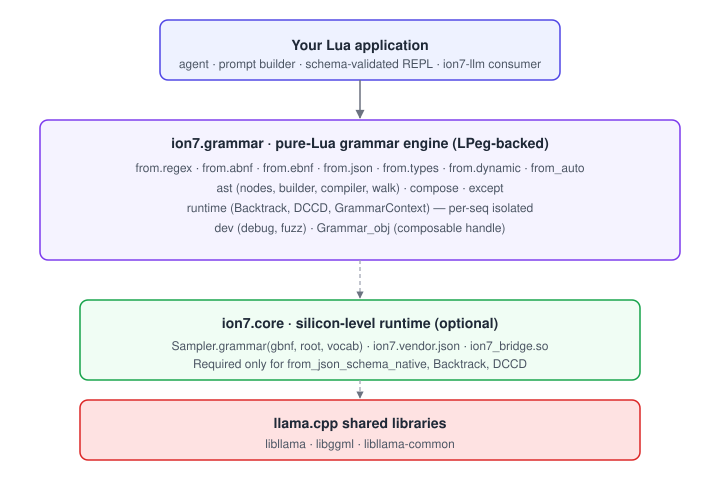
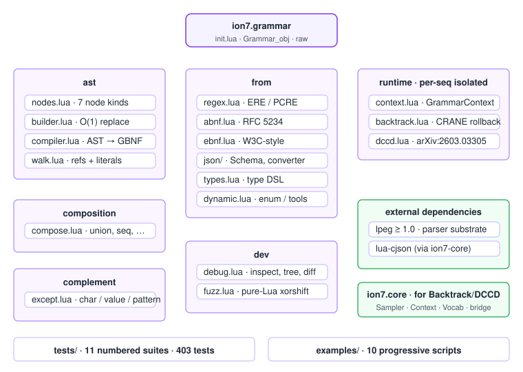
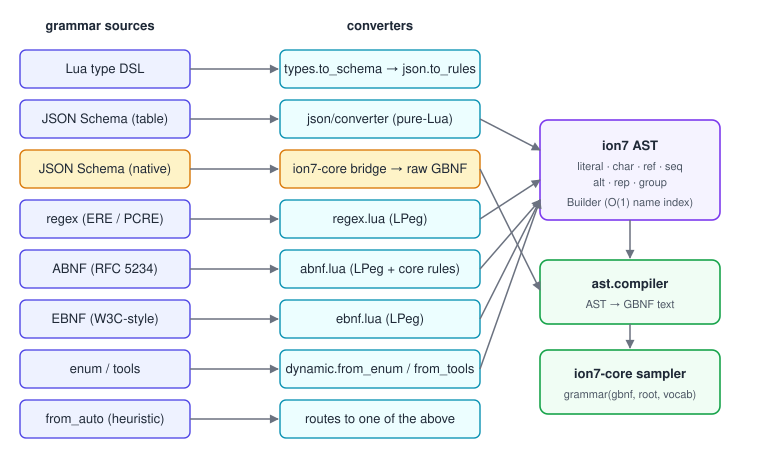
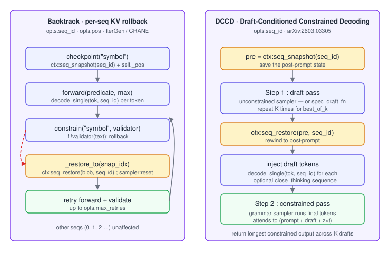

# ion7-grammar architecture

The technical decisions behind ion7-grammar, aimed at contributors and
curious users. The user-facing API surface lives in
[`README.md`](README.md) ; this document covers the **why** and the
**how** of the AST, the format converters, the runtime, and the way
ion7-grammar cooperates with ion7-core when a real model joins the
party.

---

## 1. Layered overview

<p align="center">
  
</p>

Three tiers, top to bottom :

1. **Your Lua application.** Pulls in `ion7.grammar`, hands a `Grammar_obj`
   to ion7-core's sampler. ion7-grammar is purely a library — no
   long-running components, no global state.

2. **`ion7.grammar` — the grammar engine.** Pure Lua (LPeg-backed). Owns four
   families :
   - **AST** : `nodes`, `builder`, `compiler`, `walk` — the in-memory rule
     representation and the GBNF emitter.
   - **Format converters** : `from.regex`, `from.abnf`, `from.ebnf`,
     `from.json`, `from.types`, `from.dynamic`, `from_auto`. Every entry
     point lands on the same AST.
   - **Composition** : `compose` (union, sequence, repeat, wrap,
     interleave, annotate), `except` (character / value / pattern
     complement).
   - **Runtime** : `runtime.context` (stateful grammars), `runtime.backtrack`
     (KV rollback), `runtime.dccd` (Draft-Conditioned Constrained
     Decoding). All three operate on a single seq id passed by the
     caller.

3. **`ion7.core` — the FFI layer.** Optional. Required only for
   `from_json_schema_native` (libcommon-backed schema → grammar) and the
   runtime objects (`Backtrack`, `DCCD`) which drive samplers and decode
   tokens. Pure-Lua paths run with no native dependency beyond LPeg and
   lua-cjson.

---

## 2. The AST

<p align="center">
  
</p>

Every grammar produced by ion7-grammar is internally an array of named
**rules** whose body is an **AST node**. Seven node kinds, each a plain
Lua table :

| Kind | Body | Compiled GBNF |
|---|---|---|
| `literal` | `value` | `"value"` (escaped) |
| `char` | `spec`, `negated` | `[spec]` or `[^spec]` |
| `ref` | `name` | rule reference |
| `seq` | `items[]` | space-separated parts |
| `alt` | `items[]` | `\|`-separated alternatives |
| `rep` | `node`, `min`, `max` | `*`, `+`, `?`, `{n}`, `{n,m}` |
| `group` | `node` | parenthesised |

Constructors live in
[`src/ion7/grammar/ast/nodes.lua`](src/ion7/grammar/ast/nodes.lua) and
are intentionally trivial — building an AST node is a single table
allocation.

The **`Builder`** (`ast/builder.lua`) tracks an ordered rule list and a
name → index map, so `:rule(name, body)` is O(1) whether you are adding
a new rule or replacing an existing one. `:compile()` walks the rules
through `ast/compiler.lua`, which renders each node back to GBNF text.
The compiler injects a default `ws` rule when a body references it but
no explicit definition exists.

`ast/walk.lua` provides `collect_refs` and `first_literals`, used by the
debug helper, the trigger-words derivation, and the ABNF/EBNF
constructors when they need to know what core rules a grammar pulls in.

---

## 3. Format converters

<p align="center">
  
</p>

Eight entry points, all returning a `Grammar_obj` :

### 3.1 LPeg-backed parsers — `from_regex`, `from_abnf`, `from_ebnf`

The three textual formats share the same shape :

```
input string  ──parse──▶  ion7 AST  ──compile──▶  GBNF
              │                   │
              └─ LPeg grammar ────┘
                 with action captures
```

Each parser file declares an LPeg grammar with `lpeg.P{...}` and uses
captures (`C`, `Ct`, `Cg`) plus action functions to produce AST nodes
directly during the parse — no intermediate concrete syntax tree. The
action functions live in the same file as the grammar so the data flow
is local.

**`from_regex`** parses ERE / PCRE-subset (`\d`, `\w`, `\s`, ranges,
quantifiers, alternation, groups). Anchors `^$` are consumed and
ignored — GBNF has no anchor concept.

**`from_abnf`** parses RFC 5234 §4 verbatim (`name = body`, `*` /
`1*5` repeat prefixes, `%x41-5A` numeric values, `[ ... ]` optional,
core rules `ALPHA` / `DIGIT` / etc. injected lazily). Strings are
case-sensitive — use `%x` ranges to express case-insensitivity. The
incremental alternative (`=/`) and prose values (`<...>`) raise
clearly rather than producing surprising grammars.

**`from_ebnf`** parses W3C-style EBNF (`::=`, `|`, postfix `?` `*`
`+`, `[a-z]` regex-like classes, `#xNN` hex codes). Block comments
(`/* ... */`) are stripped before parsing. The set-difference operator
(`A - B`) is rejected — model it via the parent grammar.

### 3.2 JSON Schema — `from_json_schema`, `from_json_schema_native`

The pure-Lua `from_json_schema` walks a draft-07 schema (`type`,
`properties`, `required`, `additionalProperties`, `items`, `enum`,
`oneOf`, `anyOf`, `allOf`, `$ref`, `pattern`, `minLength` /
`maxLength`, `minItems` / `maxItems`, `const`) and emits AST rules.
Sort order is deterministic so the resulting GBNF stays prefix-stable
across builds — important for the KV prefix cache in ion7-llm.

`from_json_schema_native` routes through ion7-core's libcommon binding
(`bridge.ion7_json_schema_to_grammar`) and returns a raw GBNF string.
Prefer it for schemas with unusual `$ref` graphs or strict format
validators.

### 3.3 `from_type` and `from_enum` / `from_tools`

`from_type` accepts the ion7 mini type DSL (`"string"`, `"integer?"`,
`{ key = "T" }`, `{ "T" }`) and translates it to a JSON Schema, then
runs the pure-Lua converter. Shortest path from "I want a JSON object
shaped like X" to a grammar.

`from_enum`, `from_json_enum` and `from_tools` (in `from/dynamic.lua`)
build grammars from runtime tables — names sorted longest-first to
prevent prefix ambiguity. `from_tools` produces an OpenAI-style
`{ "name": "...", "arguments": { ... } }` envelope grammar from a tool
registry.

### 3.4 Heuristic detection — `from_auto`

`from_auto(source, root)` peeks at the input :

| First match | Routed to |
|---|---|
| starts with `{` and parses as JSON | `from_json_schema` |
| contains `::=` | `from_ebnf` |
| has at least one `name = body` line (no `::=`) | `from_abnf` |
| anything else | `from_regex` |

Best-effort. If you know the format up front, prefer the explicit
constructor — `from_auto` is for the prompt-driven case where the
format itself comes from the model.

---

## 4. Composition

`compose.lua` exposes `union`, `sequence`, `repeat_g`, `optional`,
`wrap`, `interleave` and `annotate`. Each operator returns a new
`Grammar_obj` ; the source grammars are not mutated. Internal rules of
input grammars are prefixed (`a-` and `b-`) and refs are rewritten so
the composed grammar has no name collisions.

`except.lua` provides three flavours of complement that GBNF cannot
express directly :

- `except_chars(spec, exclude)` — exact, character-level.
- `except_values(universe, exclude)` — exact, finite enum complement.
- `except_prefix(grammar, prefixes)` — approximate, drops the
  forbidden first char.
- `except_pattern(pattern)` — Lua-pattern post-filter, used by the
  `Backtrack` runtime as a validator.

---

## 5. The runtime

<p align="center">
  
</p>

Three objects, all per-seq isolated. Each accepts an explicit
`opts.seq_id` (default `0`) and operates on `ctx:seq_snapshot(seq_id)` /
`seq_restore(blob, seq_id)` rather than the whole-context APIs — so
running a `Backtrack` on seq 3 cannot disturb seq 0's KV row in a
multi-tenant deployment.

### 5.1 `runtime.context.GrammarContext`

A grammar that **grows with the conversation**. Register enums
(`learn_enum`), tables (`learn_table`), tools (`learn_tool`) or custom
rules (`learn_rule`) at any point — `current()` returns the
materialised `Grammar_obj`, cached until a `learn_*` or `forget()`
call invalidates it. `snapshot()` and `restore()` serialise the entire
learned state for branching scenarios.

### 5.2 `runtime.backtrack.Backtrack`

A KV-rollback session for IterGen / CRANE-style constrained
generation :

1. `bt:checkpoint("symbol")` saves a per-seq snapshot (`seq_snapshot`)
   plus the local position counter.
2. `bt:forward(predicate)` decodes tokens until a stop predicate fires.
3. `bt:constrain("symbol", validator)` validates the current text — on
   failure, `seq_restore`s to the symbol's checkpoint and re-runs
   `forward`.

Position tracking is local (`self._pos`) so the engine's `_n_past`
mirror is only used as a write-target for `decode_single`, never as
state.

### 5.3 `runtime.dccd.DCCD`

Draft-Conditioned Constrained Decoding (arXiv:2603.03305) :

```
prompt KV  ──┐
             ├─ Step 1 : draft pass with the unconstrained sampler
             │           (or a single n-gram speculative draft via spec_draft_fn)
             │
             └─ Step 2 : seq_restore to pre-draft → inject draft tokens
                         → optional "\n</think>\n" → constrained pass
```

`best_of_k > 1` runs Step 1 K times, each starting from the same
pre-draft snapshot, and keeps the constrained pass that produced the
longest output. The streaming callbacks (`on_draft_token`,
`on_final_token`) fire during the K=1 path ; for K > 1 the winning
draft is replayed through the callback once selected.

---

## 6. Multi-session safety

ion7-grammar does not own a context. The caller (typically ion7-llm's
`Engine` or `Pool`) does. `Backtrack` and `DCCD` cooperate with that
ownership by :

- accepting `opts.seq_id` (default `0`) at construction,
- using `ctx:seq_snapshot(seq_id)` and `ctx:seq_restore(blob, seq_id)`
  for save / restore — not the whole-context blobs,
- calling `ctx:decode_single(tok, seq_id)` so tokens land in the right
  seq's KV row,
- tracking position locally rather than relying on the shared
  `_n_past` mirror.

The contract :

> A `Backtrack` or `DCCD` instance is responsible for `opts.seq_id`'s
> KV row from construction until you discard it. Other seqs are not
> touched. If multiple instances claim the same seq id concurrently
> the result is undefined — exactly the same contract as ion7-llm's
> `Session`.

---

## 7. Dev tools

`dev/debug.lua` ships four helpers :

- `Grammar.debug(g)` — annotated GBNF with rule-reference counts,
- `Grammar.analyze(g)` — structured stats (n_rules, root, unreferenced,
  recursive),
- `Grammar.tree(g)` — ASCII rule-dependency tree,
- `Grammar.diff(g1, g2)` — added / removed / changed rules.

`dev/fuzz.lua` is a **pure-Lua** random generator that walks the AST
and produces strings the grammar accepts, without a model. Two uses :

- `Grammar.fuzz_validate(g)` confirms a grammar is satisfiable (catches
  over-constrained schemas that yield only empty matches),
- `Grammar.fuzz(g, { count = N })` produces sample outputs for unit
  tests and documentation.

The fuzzer caps recursion via `opts.max_depth` and repetition via
`opts.max_rep` so recursive grammars (`expr → term → factor → expr`)
do not blow the heap.

---

## 8. Rockspec composition

The 0.2 line ships these external dependencies :

| Dependency | Why |
|---|---|
| `lua-cjson >= 2.1` | The `from_json_schema_native` round-trip and the `tool_pipeline` parser. Re-exported as `ion7.vendor.json`. |
| `lpeg >= 1.0` | The grammar parsers for regex, ABNF, EBNF. |
| `ion7-core` | The C bridge for native schema-to-grammar and the runtime objects (`Backtrack`, `DCCD`). |

ion7-core's libllama is loaded lazily — pure-Lua paths in ion7-grammar
do not require it, only the runtime objects and `from_json_schema_native`
do.

---

## 9. Trade-offs and non-goals

**Recursion in grammars is not a non-goal — but the fuzzer caps
recursion with `max_depth` to keep test runs deterministic.** Real
GBNF samplers do not have this concern ; the cap is purely a fuzzer
safeguard.

**Case-insensitive ABNF strings are not implemented.** Adding them
would expand `"foo"` to `( "f" / "F" ) ( "o" / "O" ) ( "o" / "O" )` —
several rule-bodies' worth of noise per literal. Use `%x` ranges when
you need case-insensitivity ; we lose RFC fidelity but keep readable
GBNF.

**ion7-grammar does not parse GBNF back into an AST.** The compiler is
one-way. If you have hand-written GBNF you want to reuse, pass it
through `Grammar.raw()` ; the resulting `Grammar_obj` does not support
`merge` / `fuzz` / `trigger_words` since there is no AST to walk.

**ion7-grammar does not sample.** Sampling lives in ion7-core. The
`g:to_gbnf()` output is the boundary — feed it to
`ion7.Sampler.chain():grammar(gbnf, "root", vocab)` and you are done.
